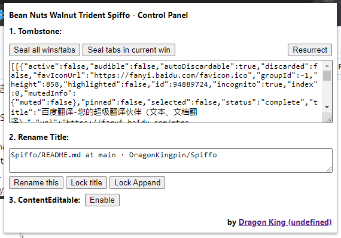
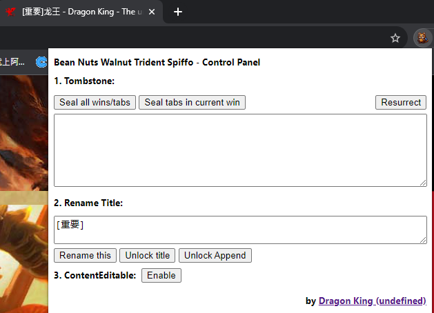
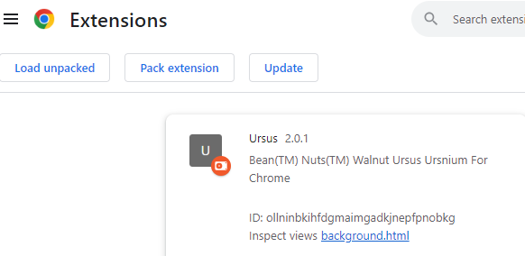
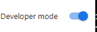

# Spiffo

  

  <strong>
  谷歌浏览器，Chrome, 插件，选项卡、窗口保存/还原，标题修改（支持追加模式），一键开启自由编辑模式，广告过滤
   </strong>

  

   

   

  <b>中英双语</b> | <a href="https://www.nutsky.com">Nuts Projects</a> | 
  <a href="https://www.dragonking.cn" target="_blank">Dragon King</a>

## Abstract
你是否在为过多的选项卡的管理而烦劳？你是否希望工作区信息能够保存和共享？你是否希望不同设备的工作记录共享？你是否为某些网站禁止内容复制而烦劳？
Spiffo 一个非常萌萌哒的小工具，Chrome 状态保存和本地化的小工具，支持保存选项卡、窗口等状态，标题修改（支持追加模式），一键开启自由编辑模式，支持常见广告过滤。\
Chrome status tombstone tiny-tools, to store tabs windows, to modify title, oneway to set contentEditable, and to sift common ads. \
Copyright(C) Bean Nuts Walnut Trident Spiffo, Bean Nuts Digital Foundation

# What does it support | 支持啥
## 将你的 选项卡、窗口等状态封印到 JSON 当中 | Seal and Store your tabs and windows status into JSON tombstone
这允许你保存你已打开的选项卡和窗口信息 (不包含表单和Cookies信息)，但是保存必要的位置、选项卡等工作区信息，你可以选择对他们二次加密或在其他计算机中传播。\
这样你可以自己决定哪些历史记录应该被保存，历史记录也将变成JSON信息，深度保护你的隐私，解决 Incognito 等隐私模式的历史记录的痛点。\
This allows you to store the information of tabs and windows you have opened (No form or cookies), while retaining essential workspace information such as positions and tabs. You can choose to encrypt them again or share them on other computers by JSON string.\
You can personally decide which browsing history should be saved. The history records will also be transformed into JSON information, deeply safeguarding your privacy and addressing the pain points of history records in Incognito mode.

 
1. 如图所示，将你打开的选项卡或窗口，保存到 JSON 字符串中\
As shown in the figure, save the tabs or windows you've opened into a JSON String.
2. 支持封印全部窗口全部选项卡（Seal all wins/tabs）和封印当前窗口全部选项卡（Seal tabs in current win）。

## 从封印的 JSON 墓碑表，复活 | Resurrect from sealed Tombstone
这允许你将封印的信息从墓碑中复活，重新还原你任意还原点，存档工作区信息，就像游戏存档一样。\
你可以保存多个不同主题、时间、任务等分组还原点，并从这些还原点任意还原到你当初的工作状态，这更便于你在不同设备上更灵活的传输你的工作区信息。

This allows you to resurrect sealed information from the tombstone, restoring any chosen check point and archiving workspace information, much like saving a game.\
You can save multiple check points (Tombstone) grouped by different themes, times, tasks, etc., and freely restore to your initial working state from any of these check points.

如图所示，点击 Resurrect，立即还原你之前所有保存的还原点\
As shown in the figure, clicking "Resurrect" instantly restores all previously saved check points from JSON String.

## Modify title of tabs | 修改标题
修改窗口标签的标题，支持直接修改标题、锁定标题、追加标题三种模式。
1. 修改标题，这仅仅只修改当前选项卡的标题，如果页面更新或DOM更新不会自动更新。
2. 锁定标题，这将锁定选项卡标题，及时页面有更新也会立即修改回自定义标题。
3. 追加标题，这允许自定义添加标题前缀，同时保留标题的更新，你可以为选项卡打上你希望的标签，且页面更新不会破坏你的标签。\

Modify the window tab title, supporting three modes: directly modify the title, lock the title, and append to the title.
1. Modify the title: This only changes the title of the current tab, and it will not automatically update if the page or DOM is refreshed.
2. Lock the title: This locks the tab's title. Even if the page is updated, the title will immediately revert to the custom title.
3. Append to the title: This allows you to customize a title prefix while retaining title updates. You can tag the tab with the label you want, and page updates will not interfere with your label.

## Control content editable | 一键开启自由编辑模式
这允许你将整个页面一键设置成可写模式，便于你演示和测试页面，同时对于绝大部分防止内容复制的网站，该方法可以屏蔽防复制的限制。

This allows you to set the entire page to editable mode, 
making it convenient for you to demonstrate and test the page. At the same time, 
for most websites that prevent content copying, this method can bypass the restrictions on copying content.

## Sifting some ads | 过滤一些广告
这些是自动包含的，都是我常用的一些小脚本，可自行编辑。
These are automatically included and are some tiny scripts I commonly use, which can be edited at your discretion.

## How to use? | 怎么用？
这可能需要你打开谷歌浏览器的开发者模式，然后拖过去就行了，你也可以二次修改加一些小功能。\
This might require you to open the developer mode in the Google Chrome browser, then simply drag and drop it, and you can also make secondary modifications to add some additional functionalities if needed.\
 \

